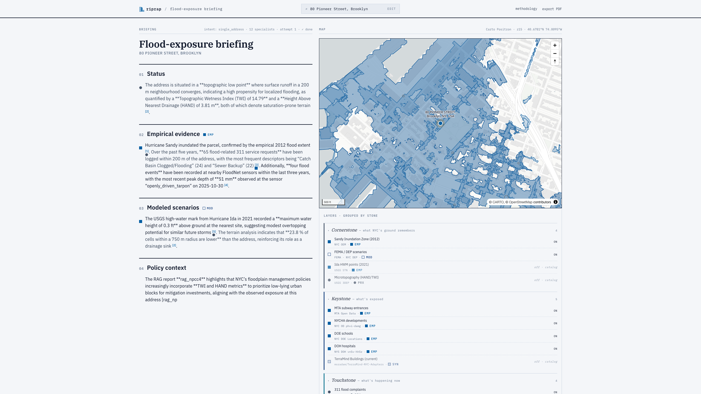

<p align="left">
  
</p>

# Riprap

## Flood risk analysis for any NYC address.

A multi-agent AI system that reads satellites, watches sensors, forecasts
surges, and refuses to ship a sentence it cannot ground in a citation.



Live demo: <https://lablab-ai-amd-developer-hackathon-riprap-nyc.hf.space>

> **Now an open-source civic-tech framework.** NYC is the reference
> deployment. Five live deployments share the same code (NYC, Chicago,
> Seattle, San Francisco, Boston) — adding your city is a directory of
> YAML, not a fork.
>
> - **[`docs/multi-city.md`](docs/multi-city.md)** — five cities, two
>   open-data platforms (Socrata + CKAN), one codebase.
> - **[`docs/byod.md`](docs/byod.md)** — drop your own data in via
>   `.riprap/` auto-discovery or the `RIPRAP_EXTRA_MANIFESTS` env var.
> - **[`docs/PORT-YOUR-CITY.md`](docs/PORT-YOUR-CITY.md)** — walkthrough
>   for adding a new city, using the Boston port as the worked example.

---

## The problem Riprap solves

NYC has spent decades publishing the flood-exposure inputs an engineer needs:
Sandy 2012 inundation, NYC DEP stormwater scenarios, FloodNet sensors, NOAA
tide gauges, USGS 3DEP LiDAR, 311 complaints, MTA, NYCHA, schools, hospitals.
The data is public. None of it composes itself.

Every engineer doing a drainage review, every resilience office siting a
capital project, every climate-adaptation team prioritising blocks
reassembles the same evidence by hand, per address, from a dozen agencies. A
briefing that should be a tool call ends up as a half-day of manual joins.
Existing tools either return opaque vendor risk scores or skip the audit
trail a stamped engineering memo actually requires.

Riprap composes it. Type any NYC address, get a four-section,
citation-grounded briefing in about two minutes, with every claim pointing
back to a `[doc_id]` in public-record data.

---

## Quickstart

Four ways to use Riprap, in increasing order of self-host:

### 1. Try the live demo

The hosted Space runs the full pipeline. Type any NYC address.

<https://lablab-ai-amd-developer-hackathon-riprap-nyc.hf.space>

The hackathon submission was originally built against an AMD Instinct
MI300X via the AMD Developer Cloud, where the three NYC-specialised
fine-tunes were trained. For the hackathon-period demo, inference now
serves from an NVIDIA L4 Hugging Face Space (`msradam/riprap-vllm`)
co-hosting vLLM + the EO model stack — see
[`docs/DEPLOY.md`](docs/DEPLOY.md). Setting
`RIPRAP_HARDWARE_LABEL=AMD MI300X` on a redeploy swaps the energy
ledger back to MI300X figures.

### 2. Run locally with Docker

```bash
git clone https://github.com/msradam/riprap-nyc
cd riprap-nyc
cp .env.example .env
# edit .env to point RIPRAP_LLM_BASE_URL / RIPRAP_ML_BASE_URL at
# either the live demo's backends or your own self-hosted instance
docker compose up
```

Visit `http://localhost:7860`.

To self-host the GPU inference half (vLLM + the ML specialist service) on
an AMD ROCm or NVIDIA CUDA box, run:

```bash
docker compose --profile with-models up
```

Full single-command MI300X bring-up via DigitalOcean: see
[`docs/DROPLET-RUNBOOK.md`](docs/DROPLET-RUNBOOK.md).

### 3. Develop

```bash
# Python 3.12 venv via uv
uv venv && uv pip install -r requirements.txt

# SvelteKit frontend (committed pre-built; only rebuild if sources change)
cd web/sveltekit && npm ci && npm run build && cd ../..

# Local server (Ollama primary)
.venv/bin/uvicorn web.main:app --host 127.0.0.1 --port 7860

# Local server pointed at AMD MI300X (vLLM primary, Ollama fallback)
RIPRAP_LLM_PRIMARY=vllm \
RIPRAP_LLM_BASE_URL=http://<droplet-ip>:8000/v1 \
RIPRAP_LLM_API_KEY=<token> \
.venv/bin/uvicorn web.main:app --host 127.0.0.1 --port 7860

# End-to-end address suite (5 NYC addresses, intent-aware checks)
.venv/bin/python scripts/probe_addresses.py
```

### 4. Run with your city's data

Riprap ships with five working deployments (`deployments/{nyc,chicago,
seattle,sf,boston}/`). Each is a directory of YAML pebble manifests plus
a `stones.yaml`. Switch deployments with one env var:

```bash
# Brief 233 S Wacker Dr, Chicago — no code changes, real upstream data
RIPRAP_DEPLOYMENT=deployments/chicago RIPRAP_RECONCILER_TIER=no_llm \
.venv/bin/python -c "import riprap.core.burr.app as a; \
  print(a.run('233 S Wacker Dr, Chicago, IL')['paragraph'])"
```

Layer your own data on top of any deployment via [`docs/byod.md`](docs/byod.md):

```bash
# .riprap/ in your CWD is auto-discovered
mkdir -p .riprap && cp examples/byod/fdny_firehouses.{yaml,csv} .riprap/

# Same effect via env var (a colon-separated list of dirs or yaml files)
RIPRAP_EXTRA_MANIFESTS=examples/byod \
RIPRAP_DEPLOYMENT=deployments/nyc \
.venv/bin/uvicorn web.main:app --port 7860
```

Add your own city: see [`docs/PORT-YOUR-CITY.md`](docs/PORT-YOUR-CITY.md).

---

## How Riprap works: the Five Stones

Behind every briefing, around 25 atomic data probes fan out across NYC
datasets, satellite imagery, sensors, and forecasts. The **Five Stones**
group those probes into five legible roles:

> **Cornerstone** remembers. **Keystone** tallies. **Touchstone**
> watches. **Lodestone** projects. **Capstone** writes it all down with
> citations.

| Stone | Role | What fires |
|---|---|---|
| **Cornerstone** | The Hazard Reader. What the ground remembers. | Sandy 2012 inundation extent, NYC DEP stormwater scenarios, 2021 Ida USGS high-water marks, baked Prithvi-EO Ida-attributable polygons, USGS 3DEP DEM + HAND/TWI |
| **Keystone** | The Asset Register. What's exposed. | MTA subway entrances, NYCHA developments, NYC DOE schools, NYS DOH hospitals, **TerraMind-NYC Buildings LoRA** |
| **Touchstone** | The Live Observer. Current state of the city. | FloodNet ultrasonic depth sensors, NYC 311 flood complaints, NWS hourly METAR, NOAA tide-gauge water levels, **Prithvi-EO 2.0 NYC-Pluvial v2**, **TerraMind-NYC LULC LoRA** |
| **Lodestone** | The Projector. What's coming. | NWS public flood alerts, Granite TTM r2 surge nowcast (zero-shot, 6-min cadence, 9.6 h horizon), per-address 311 weekly forecast, FloodNet sensor recurrence forecast, **Granite-TTM-r2-Battery-Surge fine-tune** (96 h hourly horizon) |
| **Capstone** | The Synthesiser. Citation-grounded briefing. | Granite 4.1 + Mellea rejection sampling |

The four data-Stones run sequentially per query; the Capstone reconciles
their documents into one cited briefing.

---

## The Five Stones beyond NYC

The Five Stones taxonomy is a city-agnostic template for any
flood-vulnerable region with the right data scaffolding. The five roles
generalise; only the probes plugged into each Stone change.

| Stone | Role | What you replace |
|---|---|---|
| **Cornerstone** | Hazard memory | Local historical inundation extents, regional DEM, regulatory floodplain maps |
| **Keystone** | Asset registers | The transit, housing, education, and healthcare polygons your jurisdiction publishes |
| **Touchstone** | Live observation | Whatever live sensors and complaint streams the city or region exposes (FloodNet has analogues in Houston, Boston, Miami) |
| **Lodestone** | Forecasts | Local NWS forecast office output, regional surge or hydrologic models, time-series fine-tunes for your tide gauge |
| **Capstone** | Citation-grounded synthesis | Same |

The architectural commitments transfer unchanged: Burr FSM with one
`@action` per probe, Granite-native `role="document"` reconciliation,
Mellea four-check grounding, SSE streaming to a SvelteKit map UI, every
claim cited to its source. To port Riprap to a new city, you reimplement
each Stone's `collect()` against local data and retrain the EO and
time-series fine-tunes on your jurisdiction's imagery and gauges. The
agentic shell stays the same.

---

## NYC-specialised foundation models (Apache 2.0)

Three NYC-specific fine-tunes built on AMD Instinct MI300X via AMD
Developer Cloud, published under permissive licence.

**[`msradam/TerraMind-NYC-Adapters`](https://huggingface.co/msradam/TerraMind-NYC-Adapters).**
LoRA family on TerraMind 1.0 base. LULC mIoU 0.5866 (+6.13 pp over
full-FT baseline), TiM 0.6023, Buildings 0.5511. Trained in around 18
minutes on a single MI300X.

**[`msradam/Prithvi-EO-2.0-NYC-Pluvial`](https://huggingface.co/msradam/Prithvi-EO-2.0-NYC-Pluvial).**
NYC pluvial-flood fine-tune of Prithvi-EO 2.0. Test flood IoU 0.5979 vs
0.10 on the Sen1Floods11 base, a 6× lift. Lovász-Softmax loss with
copy-paste augmentation.

**[`msradam/Granite-TTM-r2-Battery-Surge`](https://huggingface.co/msradam/Granite-TTM-r2-Battery-Surge).**
NYC Battery storm-surge nowcast fine-tune of Granite TimeSeries TTM r2.
Test MAE 0.1091 m, 41% better than persistence and 25% better than
zero-shot.

All three are loaded at runtime by their respective FSM probes in
`app/context/` and `app/live/`. Reproduction recipes live under
`experiments/18..21/`.

---

## Architecture

```
NYC address ──► Granite 4.1 3B planner ──► Plan{intent, targets, specialists}
                                                  │
                                                  ▼
                            Five-Stone Burr FSM (one @action per probe)
                            ┌───────────┬───────────┬───────────┬──────────┐
                            ▼           ▼           ▼           ▼          ▼
                       Cornerstone  Keystone   Touchstone   Lodestone  (cont.)
                       (hazard)    (assets)    (live)       (forecast)
                            │           │           │           │
                            └───────────┴─────┬─────┴───────────┘
                                              ▼
                         build_documents() — Granite-native
                         role="document <doc_id>" messages
                                              ▼
                  Capstone: Granite 4.1 8B + Mellea rejection sampling
                  ──► 4-check grounding loop, surgical feedback rerolls
                                              ▼
                       Four-section briefing with [doc_id] citations
                                              ▼
                       SSE stream → SvelteKit UI (briefing, trace, map)
```

LLM inference is dispatched through `app/llm.py`, a LiteLLM Router shim
with two backends: **Ollama** (local dev) and **vLLM** (AMD MI300X or
NVIDIA L4 — currently L4 on `msradam/riprap-vllm`). Same `chat()`
signature in both directions; vLLM is primary for the demo, Ollama is
the auto-failover.

ML model inference (Prithvi-EO, TerraMind, TTM, GLiNER, Granite
Embedding) goes through `app/inference.py::_post`, a thin HTTP client
that hits the bearer-authenticated proxy on the inference Space. The
proxy forwards to vLLM or to the riprap-models service co-resident on
the same L4, and stamps real GPU power readings onto every response —
see the energy section below.

Source-of-truth pointers:

- `app/stones/`: the Stones taxonomy (NAME / TAGLINE / SOURCES /
  collect()) over the FSM probes.
- `app/fsm.py`: Burr FSM with one probe per `@action`.
- `app/reconcile.py`: `build_documents()` emits Granite-native
  document-role messages in canonical Stone order.
- `app/mellea_validator.py`: strict reconcile path (4-check rejection
  sampling).
- `app/llm.py`: LiteLLM Router shim. Routes to Ollama or vLLM without
  changing caller code.
- `web/main.py`: FastAPI + SSE. The stream emits
  `plan / step / token / mellea_attempt / final` events plus the
  `stone_start / stone_done` envelope around each Stone group.
- `web/sveltekit/`: primary UI (SvelteKit + adapter-static).
- `inference-vllm/proxy.py`: bearer-auth proxy on the L4 inference
  Space; runs the NVML power sampler that the energy ledger reads.
- `app/emissions.py`: per-query Tracker + hardware profiles. Records
  every LLM and ML inference call with `measured: bool`.

For the long-form architecture document, see
[`docs/ARCHITECTURE.md`](docs/ARCHITECTURE.md). Methodology and
civil-engineering framing in
[`docs/METHODOLOGY.md`](docs/METHODOLOGY.md). Lit review in
[`docs/RESEARCH.md`](docs/RESEARCH.md). Production deploy
topology in [`docs/DEPLOY.md`](docs/DEPLOY.md). Live measurements
on the canonical four-address verification set (wall-clock, real
NVML energy, Mellea grounding pass-rate) in
[`docs/BENCHMARKS.md`](docs/BENCHMARKS.md).

---

## Inference energy — measured, not estimated

Riprap reports the energy and token cost of every inference call it
makes during a briefing. The status row on the Findings region
displays a single chip:

```
✓ 1.4 Wh / 6.9K tok inference
```

The `✓` icon means every recorded call came back with a real reading
off the L4 GPU via `nvmlDeviceGetPowerUsage`. The inference Space
runs a 100 ms-cadence NVML sampler in the proxy and stamps
`X-GPU-Power-W` / `X-GPU-Energy-J` on every response; the LLM client
brackets each completion with two GETs to `/v1/power` because LiteLLM
hides response headers. When the proxy is unreachable, the chip
shows `~` or `◐` and the row falls back to a data-sheet sustained-
power estimate.

Per-call records carry `prompt_tokens`, `completion_tokens`,
`duration_s`, `power_w`, `joules`, and a `measured: bool` flag. The
full ledger is shipped on the SSE `final` event under
`emissions.calls`, so any consumer (dashboard, billing model,
reproducibility check) can reuse the data.

Detailed pipeline + verification recipe in
[`docs/EMISSIONS.md`](docs/EMISSIONS.md).

---

## Data sources

Riprap contacts only public-record federal, state, and city sources at
runtime. No commercial APIs, no proprietary scores, no opaque
aggregators.

| Source | Hosting agency | Used for |
|---|---|---|
| Hurricane Sandy 2012 inundation zone | NYC OTI / NOAA Office for Coastal Management | Cornerstone hazard memory |
| NYC DEP Stormwater Flood Maps | NYC Department of Environmental Protection | DEP modeled-scenario layers |
| Hurricane Ida 2021 USGS high-water marks | USGS Short-Term Network | Empirical validation points |
| FloodNet ultrasonic sensor network | NYU CUSP / FloodNet | Live water-depth observations |
| NYC 311 flood complaints | NYC Open Data | Empirical complaint history |
| NOAA tide gauge, The Battery | NOAA CO-OPS | Live tide and surge level |
| NWS METAR | National Weather Service | Hourly precipitation |
| NWS public flood alerts | National Weather Service | Active warnings and watches |
| MTA subway entrances | MTA / NYC Open Data | Transit asset register |
| NYCHA developments | NYC Housing Authority | Public-housing exposure |
| NYC DOE schools | NYC Department of Education | Education-asset exposure |
| NYS DOH hospitals | New York State Department of Health | Critical-facility exposure |
| USGS 3DEP 1 m DEM | USGS National Map | HAND / TWI microtopography |
| NYC DOB filings | NYC Department of Buildings | Development-check intent |
| NPCC4 SLR projections | NYC Mayor's Office of Climate & Environmental Justice | Policy-context corpus (RAG) |
| Sentinel-2 MSI imagery | ESA / Copernicus | Prithvi + TerraMind inputs |

The full data licence map and vintage table is enumerated in
[`docs/ARCHITECTURE.md`](docs/ARCHITECTURE.md).

---

## Repository structure

```
app/                       Python — Burr FSM, specialists, reconciler
├── fsm.py                 One @action per probe, plus the Stones taxonomy
├── llm.py                 LiteLLM Router shim (Ollama / vLLM)
├── inference.py           HTTP client for the riprap-models service
├── emissions.py           Per-query energy + token ledger (real NVML)
├── reconcile.py           Granite-native document reconcile (Capstone)
├── mellea_validator.py    Mellea four-check rejection sampling
├── stones/, intents/      Stone definitions + intent dispatchers
├── flood_layers/          Cornerstone hazard probes
├── context/, registers/   Keystone + Touchstone register / EO probes
└── live/                  Lodestone forecast probes

web/                       FastAPI + SvelteKit
├── main.py                FastAPI app, SSE streaming, layer endpoints
├── sveltekit/             Primary UI (adapter-static; build committed)
└── static/                Legacy custom-element pages (still mounted)

inference-vllm/            Inference Space (vLLM + EO models + proxy)
├── Dockerfile             L4 image, bakes Granite 4.1 8B FP8 + EO deps
├── entrypoint.sh          Boots vllm, riprap-models, proxy together
└── proxy.py               Bearer-auth + NVML sampler + SSE pass-through

inference/                 Ollama-backed inference Space (fallback)
services/riprap-models/    EO/forecast specialist HTTP service

scripts/                   Probes, register builders, deploy commands
experiments/               Reproduction recipes for the three NYC fine-tunes
docs/                      ARCHITECTURE · DEPLOY · EMISSIONS · METHODOLOGY · RESEARCH
tests/                     pytest suite (envelope + compare-shape)
```

[`CONTRIBUTING.md`](CONTRIBUTING.md) covers dev setup, the probe
scripts, and house style. [`CHANGELOG.md`](CHANGELOG.md) tracks
changes since the v0.5.0 hackathon submission.

---

## Citation

If you reference Riprap in academic or professional work:

```bibtex
@software{riprap_nyc_2026,
  author       = {Rahman, Adam Munawar},
  title        = {Riprap: Citation-Grounded NYC Flood-Exposure Briefings},
  year         = {2026},
  url          = {https://github.com/msradam/riprap-nyc},
  version      = {v0.5.0},
  note         = {Built for the AMD x lablab.ai Developer Hackathon}
}
```

---

## License

Apache 2.0. See [`LICENSE`](LICENSE) and [`NOTICE`](NOTICE).

The three NYC-specialised fine-tunes above are also Apache 2.0;
underlying upstream models retain their own permissive licences (see
each `MODEL_CARD.md`). Public-record data sources retain their own
access terms; the licence map is in
[`docs/ARCHITECTURE.md`](docs/ARCHITECTURE.md).

---

## Acknowledgments

- **AMD Developer Cloud**, MI300X compute that made the three Apache-2.0
  NYC fine-tunes feasible.
- **AMD × lablab.ai Developer Hackathon**, the venue.
- **IBM Research**, Granite 4.1, Granite Embedding 278M, Granite TTM r2,
  Mellea, and the rest of the open-source Granite ecosystem.
- **NASA / IBM Prithvi-EO 2.0** and **IBM / ESA TerraMind 1.0**, the
  geospatial foundation models behind the NYC fine-tunes.
- **NYU CUSP / FloodNet**, the public sensor network whose data Riprap
  reads live.
- **Andrew Hicks**, civil-engineering review of the methodology.
- **The Riprap dam mark**, ["Dam" by Chintuza](https://thenounproject.com/icon/dam-4516918/)
  via the Noun Project, licensed CC-BY 3.0. The original SVG embedded
  the attribution as on-canvas text; Riprap's `assets/logo*.svg` strips
  the embedded text and carries the credit here in body copy instead,
  per the Creative Commons attribution requirement.